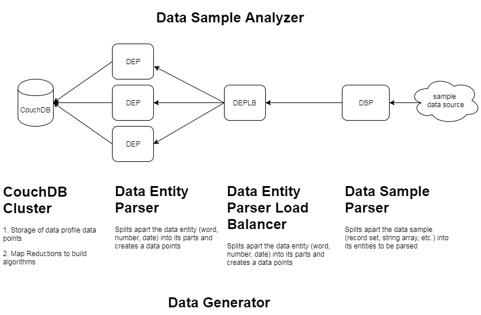

## Test Data Generation

### Description
**PROBLEM**
In order to make test data represent production, (a.k.a. realistic) you need to perform one of the following:
+ load data from a production environment into the non-production environment, which requires ETL (e.g.: masking, obfuscation, etc.)
+ stand up a pre-loaded "profile" database that is randomly sampled, which requires preparing sample data from either another test data source 
or production environment (option #1 above)

**SOLUTION**
 By analyzing a sample data set (e.g.: 2016 Census of top 200 male first names), we are able to recreate an algorithm based on that data profile. 
 This algorithm can be easily stored (data file) and used to generate "realistic" test data as desired. 

### Archtecture
Inline-style: 

